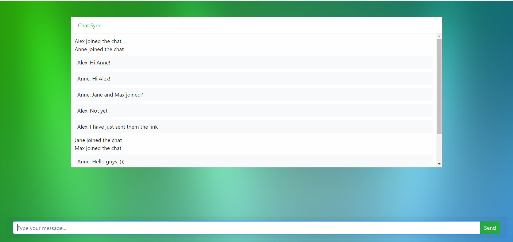

# ChatSync App

## [Live Demo](https://chatsync-production.up.railway.app/)
A real-time messaging application built with Node.js, Express.js, and Socket.IO.

## Description

ChatSync App is a simple web-based messaging application that allows users to engage in real-time text-based conversations. Users can open the application in different browsers to chat with each other simultaneously.

## Features

- **Real-Time Messaging:** Chat with multiple users simultaneously in real-time.
- **User Authentication:** Each user can set their username upon joining the chat.

## Technologies Used

- **Node.js:** A JavaScript runtime environment used for server-side development.
- **Express.js:** A web application framework for Node.js used to handle routing and server logic.
- **Socket.IO:** A library that enables real-time, bidirectional communication between web clients and servers using WebSockets or fallback mechanisms.
- **HTML/CSS/JavaScript:** Frontend technologies used to create the user interface and handle client-side functionality.

